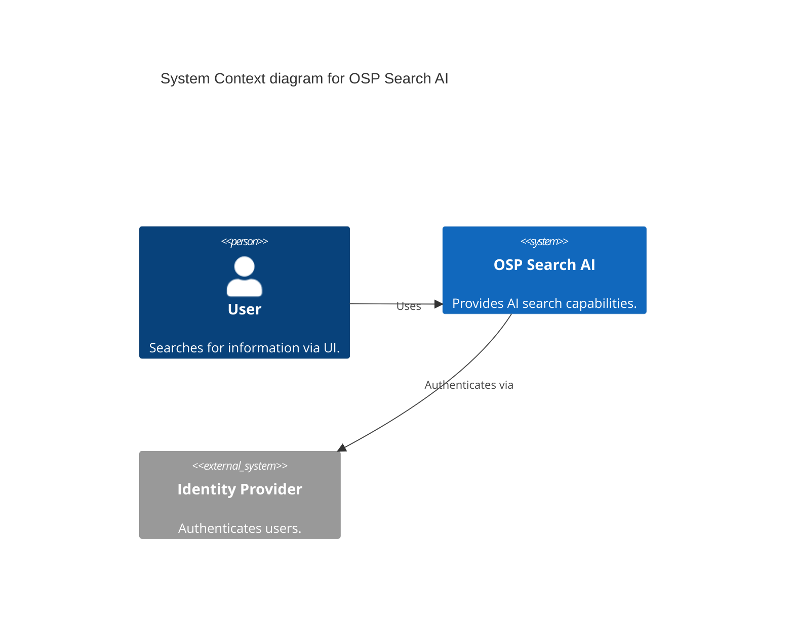
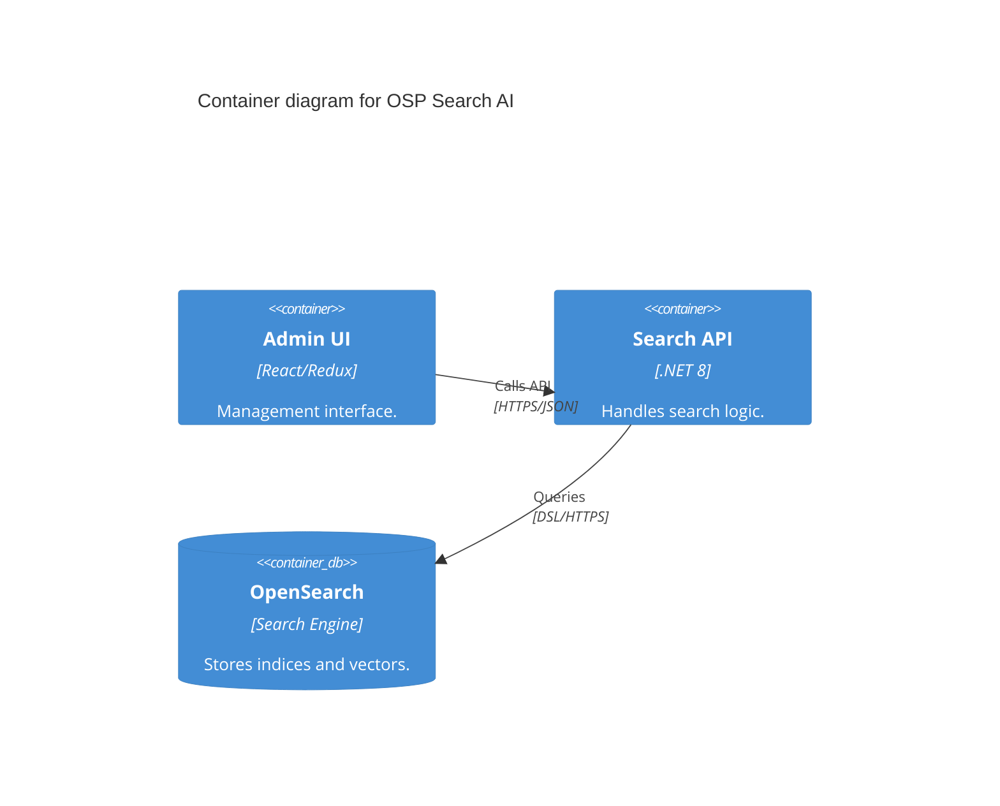

# C4 Model: Architecture Documentation Standard

The C4 model (Context, Container, Component, Code) provides different levels of abstraction for software architecture, suitable for both technical and non-technical stakeholders.

## 📊 The 4 Levels of C4

### 1. System Context (L1 - The Big Picture)
- **Objective**: Shows who interacts with the system (Personas) and which external systems are involved.
- **Audience**: Everyone (Technical & Business).
- **Mermaid Template**:

### 2. Container (L2 - Applications & Data)
- **Objective**: Displays deployment units (Web App, API, Database, Cache).
- **Audience**: Developers, DevOps.
- **Mermaid Template**:

### 3. Component (L3 - Internal Parts)
- **Objective**: Decomposes a Container into logical components (Services, Repositories, Controllers).
- **Audience**: Architects, Developers.

### 4. Code (L4 - Implementation Detail)
- **Objective**: Class diagrams, interfaces, or database schemas. Only performed for extremely complex modules.

---

## 🛠️ Bottom-Up Documentation Workflow
To document an existing codebase, work from the bottom up:
1. **Code Analysis**: Scan subdirectories to understand the functionality of each module.
2. **Component Identification**: Group code modules into logical components.
3. **Container Identification**: Map components to deployment units (Docker, K8s).
4. **Context Identification**: Synthesize into the system's big picture.

## 📋 C4 Documentation Checklist
- [ ] Are all **Personas** (User, Admin, Bot) clearly identified?
- [ ] Are all **External Systems** (Payment, Mail, Auth) listed?
- [ ] Does the Container diagram specify **Technology** and **Protocol**?
- [ ] Do components have short descriptions of their responsibilities?
- [ ] Is the proper **Mermaid C4** syntax used for visualization?
