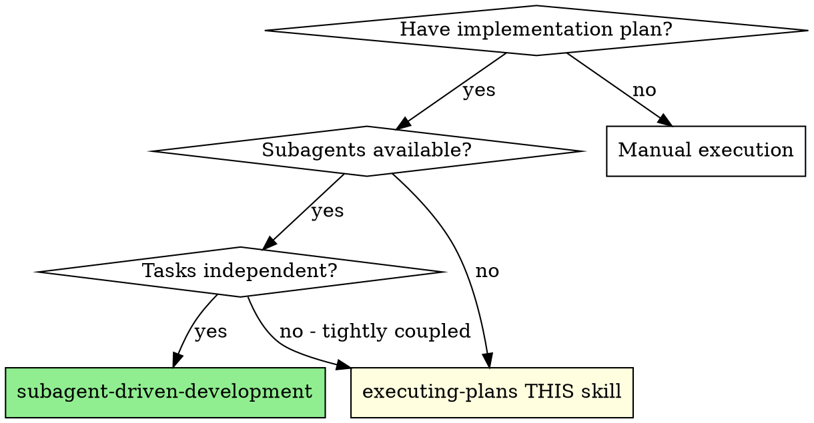

# Executing Plans

## 🧭 Execution Logic
Select the optimal execution model based on task independence:

| Condition | Recommended Skill |
| :--- | :--- |
| Tasks are independent & subagents available | `subagent-driven-development` |
| Tasks are tightly coupled | `executing-plans` (Manual/Sequential) |
| Requirements are vague | `brainstorming` |

## ⚙️ Process
1. **Load & Review**: Identify concerns before starting.
2. **Execute**: Mark tasks as `in_progress`, follow steps exactly, and run verifications.
3. **Finish**: Use `finishing-a-development-branch` protocol.

## 🛑 STOP Rule
Stop immediately if:
- Hit a blocker or missing dependency.
- Verification fails repeatedly.
- Plan has critical gaps.

## Overview
Load plan, review critically, execute all tasks, report when complete.

**Announce at start:** "I'm using the executing-plans skill to implement this plan."

## Choosing the Right Execution Skill

> **If subagents are available AND tasks are independent:** Use `subagent-driven-development` instead of this skill. It provides fresh context per task and two-stage review (spec compliance + code quality) for higher quality output.

## The Process

### Step 1: Load and Review Plan
1. Read plan file
2. Review critically - identify any questions or concerns about the plan
3. If concerns: Raise them with your human partner before starting
4. If no concerns: Create TodoWrite and proceed

### Step 2: Execute Tasks
For each task:
1. Mark as in_progress
2. Follow each step exactly (plan has bite-sized steps)
3. Run verifications as specified
4. Mark as completed

### Step 3: Complete Development
After all tasks complete and verified:
- Announce: "I'm using the finishing-a-development-branch skill to complete this work."
- **REQUIRED SUB-SKILL:** Use superpowers:finishing-a-development-branch
- Follow that skill to verify tests, present options, execute choice

## When to Stop and Ask for Help
**STOP executing immediately when:**
- Hit a blocker (missing dependency, test fails, instruction unclear)
- Plan has critical gaps preventing starting
- You don't understand an instruction
- Verification fails repeatedly

**Ask for clarification rather than guessing.**

## When to Revisit Earlier Steps
**Return to Review (Step 1) when:**
- Partner updates the plan based on your feedback
- Fundamental approach needs rethinking

**Don't force through blockers** - stop and ask.

## Remember
- Review plan critically first
- Follow plan steps exactly
- Don't skip verifications
- Reference skills when plan says to
- Stop when blocked, don't guess
- Never start implementation on main/master branch without explicit user consent

## Integration
**Required workflow skills:**
- **superpowers:using-git-worktrees** - REQUIRED: Set up isolated workspace before starting
- **superpowers:writing-plans** - Creates the plan this skill executes
- **superpowers:finishing-a-development-branch** - Complete development after all tasks
