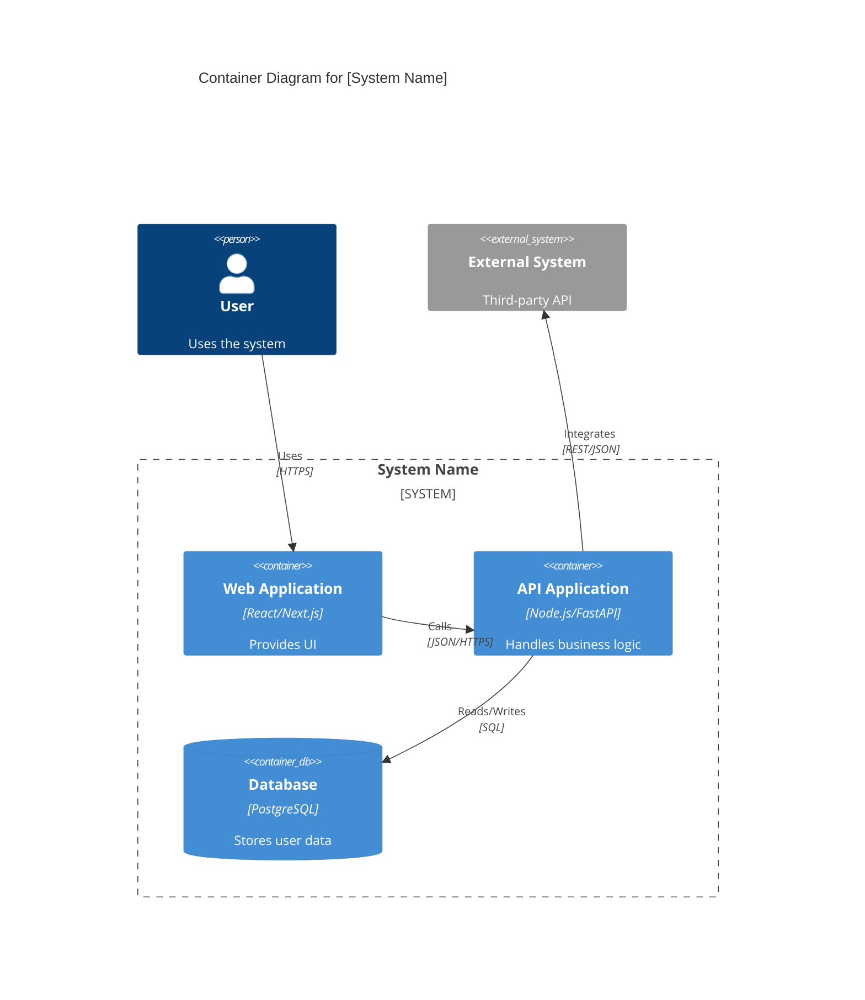

# C4 Model Diagramming

Master the art of architectural visualization using the C4 model.

## 🏗️ The C4 Hierarchy

### 1. Level 1: System Context
Shows the system in scope and its relationship with users and other systems.
- **Focus**: People and software systems.
- **Audience**: Everyone (technical and non-technical).

### 2. Level 2: Container Diagram
Shows the high-level technical building blocks (Web App, API, Database, Mobile App).
- **Focus**: Deployment units and technology choices.
- **Audience**: Developers and Operations.

### 3. Level 3: Component Diagram
Decomposes a container into its internal components (Services, Controllers, Repositories).
- **Focus**: Logical grouping of code.
- **Audience**: Developers and Architects.

### 4. Level 4: Code Diagram
Shows class-level or object-level relationships (rarely needed, use for complex logic).

## 🛠️ Mermaid Implementation Patterns

### Container Diagram Template

## 📋 Verification Checklist
- [ ] Are the diagram levels appropriate for the intended audience?
- [ ] Are technology choices clearly labeled in Container diagrams?
- [ ] Are communication protocols (HTTPS, SQL, gRPC) specified on relationships?
- [ ] Are external systems clearly distinguished from the internal system?
- [ ] Is the diagram readable and semantically correct (Mermaid syntax)?
