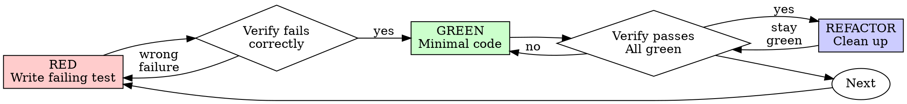

# Test-Driven Development (TDD)


## Overview
Write a failing test before writing the code that makes it pass. For bug fixes, reproduce the bug with a test before attempting a fix. Tests are proof — "seems right" is not done. A codebase with good tests is an AI agent's superpower; a codebase without tests is a liability.

Write the test first. Watch it fail. Write minimal code to pass.
**Core principle:** If you didn't watch the test fail, you don't know if it tests the right thing.
**Violating the letter of the rules is violating the spirit of the rules.**

## When to Use
- Implementing any new logic or behavior
- Fixing any bug (the Prove-It Pattern)
- Modifying existing functionality
- Adding edge case handling
- Any change that could break existing behavior

**When NOT to use:** Pure configuration changes, documentation updates, or static content changes that have no behavioral impact.
Write the test first. Watch it fail. Write minimal code to pass.

**Core principle:** If you didn't watch the test fail, you don't know if it tests the right thing.

**Always:**
- New features
- Bug fixes
- Refactoring
- Behavior changes
**Exceptions (ask your human partner):**
- Throwaway prototypes
- Generated code
- Configuration files
Thinking "skip TDD just this once"? Stop. That's rationalization.

## The Three Laws of TDD (Uncle Bob)
You must follow these laws strictly for every production file:
1. **Don't write production code** until you have a failing unit test.
2. **Don't write more of a unit test** than is sufficient to fail.
3. **Don't write more production code** than is sufficient to pass the failing test.

## The TDD Cycle
```
    RED                GREEN              REFACTOR
 Write a test    Write minimal code    Clean up the
 that fails  ──→  to make it pass  ──→  implementation  ──→  (repeat)
      │                  │                    │
      ▼                  ▼                    ▼
   Test FAILS        Test PASSES         Tests still PASS
```

### Step 1: RED — Write a Failing Test
Write the test first. It must fail. A test that passes immediately proves nothing.

```typescript
// RED: This test fails because createTask doesn't exist yet
describe('TaskService', () => {
  it('creates a task with title and default status', async () => {
    const task = await taskService.createTask({ title: 'Buy groceries' });

    expect(task.id).toBeDefined();
    expect(task.title).toBe('Buy groceries');
    expect(task.status).toBe('pending');
    expect(task.createdAt).toBeInstanceOf(Date);
  });
});
```

### Step 2: GREEN — Make It Pass
Write the minimum code to make the test pass. Don't over-engineer:

```typescript
// GREEN: Minimal implementation
export async function createTask(input: { title: string }): Promise<Task> {
  const task = {
    id: generateId(),
    title: input.title,
    status: 'pending' as const,
    createdAt: new Date(),
  };
  await db.tasks.insert(task);
  return task;
}
```

### Step 3: REFACTOR — Clean Up
With tests green, improve the code without changing behavior:

- Extract shared logic
- Improve naming
- Remove duplication
- Optimize if necessary

Run tests after every refactor step to confirm nothing broke.

## The Prove-It Pattern (Bug Fixes)
When a bug is reported, **do not start by trying to fix it.** Start by writing a test that reproduces it.

```
Bug report arrives
       │
       ▼
  Write a test that demonstrates the bug
       │
       ▼
  Test FAILS (confirming the bug exists)
       │
       ▼
  Implement the fix
       │
       ▼
  Test PASSES (proving the fix works)
       │
       ▼
  Run full test suite (no regressions)
```

**Example:**

```typescript
// Bug: "Completing a task doesn't update the completedAt timestamp"

// Step 1: Write the reproduction test (it should FAIL)
it('sets completedAt when task is completed', async () => {
  const task = await taskService.createTask({ title: 'Test' });
  const completed = await taskService.completeTask(task.id);

  expect(completed.status).toBe('completed');
  expect(completed.completedAt).toBeInstanceOf(Date);  // This fails → bug confirmed
});

// Step 2: Fix the bug
export async function completeTask(id: string): Promise<Task> {
  return db.tasks.update(id, {
    status: 'completed',
    completedAt: new Date(),  // This was missing
  });
}

// Step 3: Test passes → bug fixed, regression guarded
```

## The Test Pyramid
Invest testing effort according to the pyramid — most tests should be small and fast, with progressively fewer tests at higher levels:

```
          ╱╲
         ╱  ╲         E2E Tests (~5%)
        ╱    ╲        Full user flows, real browser
       ╱──────╲
      ╱        ╲      Integration Tests (~15%)
     ╱          ╲     Component interactions, API boundaries
    ╱────────────╲
   ╱              ╲   Unit Tests (~80%)
  ╱                ╲  Pure logic, isolated, milliseconds each
 ╱──────────────────╲
```

**The Beyonce Rule:** If you liked it, you should have put a test on it. Infrastructure changes, refactoring, and migrations are not responsible for catching your bugs — your tests are. If a change breaks your code and you didn't have a test for it, that's on you.

### Test Sizes (Resource Model)
Beyond the pyramid levels, classify tests by what resources they consume:

| Size | Constraints | Speed | Example |
|------|------------|-------|---------|
| **Small** | Single process, no I/O, no network, no database | Milliseconds | Pure function tests, data transforms |
| **Medium** | Multi-process OK, localhost only, no external services | Seconds | API tests with test DB, component tests |
| **Large** | Multi-machine OK, external services allowed | Minutes | E2E tests, performance benchmarks, staging integration |

Small tests should make up the vast majority of your suite. They're fast, reliable, and easy to debug when they fail.

### Decision Guide
```
Is it pure logic with no side effects?
  → Unit test (small)

Does it cross a boundary (API, database, file system)?
  → Integration test (medium)

Is it a critical user flow that must work end-to-end?
  → E2E test (large) — limit these to critical paths
```

## Writing Good Tests


### Test State, Not Interactions
Assert on the *outcome* of an operation, not on which methods were called internally. Tests that verify method call sequences break when you refactor, even if the behavior is unchanged.

```typescript
// Good: Tests what the function does (state-based)
it('returns tasks sorted by creation date, newest first', async () => {
  const tasks = await listTasks({ sortBy: 'createdAt', sortOrder: 'desc' });
  expect(tasks[0].createdAt.getTime())
    .toBeGreaterThan(tasks[1].createdAt.getTime());
});

// Bad: Tests how the function works internally (interaction-based)
it('calls db.query with ORDER BY created_at DESC', async () => {
  await listTasks({ sortBy: 'createdAt', sortOrder: 'desc' });
  expect(db.query).toHaveBeenCalledWith(
    expect.stringContaining('ORDER BY created_at DESC')
  );
});
```

### DAMP Over DRY in Tests
In production code, DRY (Don't Repeat Yourself) is usually right. In tests, **DAMP (Descriptive And Meaningful Phrases)** is better. A test should read like a specification — each test should tell a complete story without requiring the reader to trace through shared helpers.

```typescript
// DAMP: Each test is self-contained and readable
it('rejects tasks with empty titles', () => {
  const input = { title: '', assignee: 'user-1' };
  expect(() => createTask(input)).toThrow('Title is required');
});

it('trims whitespace from titles', () => {
  const input = { title: '  Buy groceries  ', assignee: 'user-1' };
  const task = createTask(input);
  expect(task.title).toBe('Buy groceries');
});

// Over-DRY: Shared setup obscures what each test actually verifies
```

Duplication in tests is acceptable when it makes each test independently understandable.

### Prefer Real Implementations Over Mocks
Use the simplest test double that gets the job done. The more your tests use real code, the more confidence they provide.

```
Preference order (most to least preferred):
1. Real implementation  → Highest confidence, catches real bugs
2. Fake                 → In-memory version of a dependency (e.g., fake DB)
3. Stub                 → Returns canned data, no behavior
4. Mock (interaction)   → Verifies method calls — use sparingly

## F.I.R.S.T. Strategy
- **Fast**: Tests should run quickly to provide instant feedback.
- **Independent**: Tests should not depend on the state or execution order of other tests.
- **Repeatable**: Tests should produce the same results in any environment (CI, Local).
- **Self-Validating**: Each test should have a clear binary pass/fail result.
- **Timely**: Tests are written just before the production code (TDD).
```

**Use mocks only when:** the real implementation is too slow, non-deterministic, or has side effects you can't control (external APIs, email sending). Over-mocking creates tests that pass while production breaks.

### Use the Arrange-Act-Assert Pattern
```typescript
it('marks overdue tasks when deadline has passed', () => {
  // Arrange: Set up the test scenario
  const task = createTask({
    title: 'Test',
    deadline: new Date('2025-01-01'),
  });

  // Act: Perform the action being tested
  const result = checkOverdue(task, new Date('2025-01-02'));

  // Assert: Verify the outcome
  expect(result.isOverdue).toBe(true);
});
```

### One Assertion Per Concept
```typescript
// Good: Each test verifies one behavior
it('rejects empty titles', () => { ... });
it('trims whitespace from titles', () => { ... });
it('enforces maximum title length', () => { ... });

// Bad: Everything in one test
it('validates titles correctly', () => {
  expect(() => createTask({ title: '' })).toThrow();
  expect(createTask({ title: '  hello  ' }).title).toBe('hello');
  expect(() => createTask({ title: 'a'.repeat(256) })).toThrow();
});
```

### Name Tests Descriptively
```typescript
// Good: Reads like a specification
describe('TaskService.completeTask', () => {
  it('sets status to completed and records timestamp', ...);
  it('throws NotFoundError for non-existent task', ...);
  it('is idempotent — completing an already-completed task is a no-op', ...);
  it('sends notification to task assignee', ...);
});

// Bad: Vague names
describe('TaskService', () => { ... });
```

## 🧠 Rationalization Prevention
Agents are smart and will find loopholes to skip TDD under pressure (time, complexity, sunk cost). You MUST identify these thoughts and counter them immediately.

| Excuse | Reality |
| :--- | :--- |
| "Too simple to test" | Simple code breaks too. A test takes 30 seconds. |
| "I'll test after" | Tests passing immediately prove nothing. You never saw them catch the bug. |
| "Tests after achieve same goals" | Tests-after = "What does this do?". Tests-first = "What should this do?". |
| "Already manually tested" | Ad-hoc != systematic. No record, can't re-run on next change. |
| "Deleting X hours is wasteful" | Sunk cost fallacy. Keeping unverified code is technical debt. |
| "Keep as reference, write tests first" | You'll adapt it. That's testing after. Delete means delete. |
| "TDD will slow me down" | TDD is faster than debugging. Pragmatic = test-first. |
| "Spirit over ritual" | Ritual ensures discipline. Shortcuts = debugging in production. |

## 🚩 Red Flags - STOP and Start Over
If you find yourself doing any of these, **DELETE THE CODE** and start over with a failing test:
- Writing production code before a test exists.
- Implementation passes on the first run.
- "Adapting" existing code while writing a test.
- "Keeping code as reference" in another tab/file while doing TDD.
- "I already manually verified it, so the test is just a formality."
- "The design is too complex for TDD" (This means the design is bad).

## Verification
After completing any implementation:

- [ ] Every new behavior has a corresponding test
- [ ] All tests pass: `npm test`
- [ ] Bug fixes include a reproduction test that failed before the fix
- [ ] Test names describe the behavior being verified
- [ ] No tests were skipped or disabled
- [ ] Coverage hasn't decreased (if tracked)

## The Iron Law (STRICT)
```
NO PRODUCTION CODE WITHOUT A FAILING TEST FIRST
```

Write code before the test? Delete it. Start over. This ensures the test actually verifies the behavior and prevents speculative coding.

**Exceptions**: 
- Very small tasks (under 1 minute) like typos or simple text changes.
- Generated code or boilerplate.
- Configuration files.

## Red-Green-Refactor Cycle
1. **RED**: Write one minimal test showing what should happen.
2. **Verify RED (MANDATORY)**: Run the test and confirm it fails for the expected reason (feature missing, not a syntax error).
3. **GREEN**: Write the simplest, most minimal code required to pass the test. No YAGNI features.
4. **Verify GREEN**: Run all tests and confirm they pass.
5. **REFACTOR**: Clean up the code (remove duplication, improve names) while keeping the tests green.

## Quality of a Good Test
- **Atomic**: Tests one specific behavior.
- **Independent**: Does not depend on the order of execution.
- **Meaningful**: Tests must demonstrate desired API behavior and domain requirements, not just implementation details. Coverage % is secondary to behavior verification.
- **Readable Assertions**: Use **FluentAssertions** (`result.Should().BeEquivalentTo(expected)`) to make the intent of the test obvious and provide descriptive failure messages.

## When Stuck
| Problem | Solution |
| :--- | :--- |
| Don't know how to test | Write wished-for API first. Write assertion first. |
| Test too complicated | Design is too complicated. Simplify interface / Use DI. |
| Must mock everything | Code is too coupled. Use Dependency Injection. |
| Test setup is huge | Extract helpers. Still complex? Simplify the design. |

|---------|----------|
| Don't know how to test | Write wished-for API. Write assertion first. Ask your human partner. |
| Test too complicated | Design too complicated. Simplify interface. |
| Must mock everything | Code too coupled. Use dependency injection. |
| Test setup huge | Extract helpers. Still complex? Simplify design. |

## Verification Checklist
- [ ] Did I watch the test fail first?
- [ ] Is the failure message clear and correct?
- [ ] Did I write the *minimal* code to pass?
- [ ] Do all other tests still pass?
- [ ] Is the code cleaner after refactoring?

Before marking work complete:
- [ ] Every new function/method has a test
- [ ] Watched each test fail before implementing
- [ ] Each test failed for expected reason (feature missing, not typo)
- [ ] Wrote minimal code to pass each test
- [ ] All tests pass
- [ ] Output pristine (no errors, warnings)
- [ ] Tests use real code (mocks only if unavoidable)
- [ ] Edge cases and errors covered
Can't check all boxes? You skipped TDD. Start over.

## The Iron Law
```
NO PRODUCTION CODE WITHOUT A FAILING TEST FIRST
```

Write code before the test? Delete it. Start over.

**No exceptions:**
- Don't keep it as "reference"
- Don't "adapt" it while writing tests
- Don't look at it
- Delete means delete

Implement fresh from tests. Period.

## Red-Green-Refactor


### RED - Write Failing Test
Write one minimal test showing what should happen.

<Good>
```typescript
test('retries failed operations 3 times', async () => {
  let attempts = 0;
  const operation = () => {
    attempts++;
    if (attempts < 3) throw new Error('fail');
    return 'success';
  };

  const result = await retryOperation(operation);

  expect(result).toBe('success');
  expect(attempts).toBe(3);
});
```
Clear name, tests real behavior, one thing
</Good>

<Bad>
```typescript
test('retry works', async () => {
  const mock = jest.fn()
    .mockRejectedValueOnce(new Error())
    .mockRejectedValueOnce(new Error())
    .mockResolvedValueOnce('success');
  await retryOperation(mock);
  expect(mock).toHaveBeenCalledTimes(3);
});
```
Vague name, tests mock not code
</Bad>

**Requirements:**
- One behavior
- Clear name
- Real code (no mocks unless unavoidable)

### Verify RED - Watch It Fail
**MANDATORY. Never skip.**

```bash
npm test path/to/test.test.ts
```

Confirm:
- Test fails (not errors)
- Failure message is expected
- Fails because feature missing (not typos)

**Test passes?** You're testing existing behavior. Fix test.

**Test errors?** Fix error, re-run until it fails correctly.

### GREEN - Minimal Code
Write simplest code to pass the test.

<Good>
```typescript
async function retryOperation<T>(fn: () => Promise<T>): Promise<T> {
  for (let i = 0; i < 3; i++) {
    try {
      return await fn();
    } catch (e) {
      if (i === 2) throw e;
    }
  }
  throw new Error('unreachable');
}
```
Just enough to pass
</Good>

<Bad>
```typescript
async function retryOperation<T>(
  fn: () => Promise<T>,
  options?: {
    maxRetries?: number;
    backoff?: 'linear' | 'exponential';
    onRetry?: (attempt: number) => void;
  }
): Promise<T> {
  // YAGNI
}
```
Over-engineered
</Bad>

Don't add features, refactor other code, or "improve" beyond the test.

### Verify GREEN - Watch It Pass
**MANDATORY.**

```bash
npm test path/to/test.test.ts
```

Confirm:
- Test passes
- Other tests still pass
- Output pristine (no errors, warnings)

**Test fails?** Fix code, not test.

**Other tests fail?** Fix now.

### REFACTOR - Clean Up
After green only:
- Remove duplication
- Improve names
- Extract helpers

Keep tests green. Don't add behavior.

### Repeat
Next failing test for next feature.

## Good Tests
| Quality | Good | Bad |
|---------|------|-----|
| **Minimal** | One thing. "and" in name? Split it. | `test('validates email and domain and whitespace')` |
| **Clear** | Name describes behavior | `test('test1')` |
| **Shows intent** | Demonstrates desired API | Obscures what code should do |

## Why Order Matters
**"I'll write tests after to verify it works"**

Tests written after code pass immediately. Passing immediately proves nothing:
- Might test wrong thing
- Might test implementation, not behavior
- Might miss edge cases you forgot
- You never saw it catch the bug

Test-first forces you to see the test fail, proving it actually tests something.

**"I already manually tested all the edge cases"**

Manual testing is ad-hoc. You think you tested everything but:
- No record of what you tested
- Can't re-run when code changes
- Easy to forget cases under pressure
- "It worked when I tried it" ≠ comprehensive

Automated tests are systematic. They run the same way every time.

**"Deleting X hours of work is wasteful"**

Sunk cost fallacy. The time is already gone. Your choice now:
- Delete and rewrite with TDD (X more hours, high confidence)
- Keep it and add tests after (30 min, low confidence, likely bugs)

The "waste" is keeping code you can't trust. Working code without real tests is technical debt.

**"TDD is dogmatic, being pragmatic means adapting"**

TDD IS pragmatic:
- Finds bugs before commit (faster than debugging after)
- Prevents regressions (tests catch breaks immediately)
- Documents behavior (tests show how to use code)
- Enables refactoring (change freely, tests catch breaks)

"Pragmatic" shortcuts = debugging in production = slower.

**"Tests after achieve the same goals - it's spirit not ritual"**

No. Tests-after answer "What does this do?" Tests-first answer "What should this do?"

Tests-after are biased by your implementation. You test what you built, not what's required. You verify remembered edge cases, not discovered ones.

Tests-first force edge case discovery before implementing. Tests-after verify you remembered everything (you didn't).

30 minutes of tests after ≠ TDD. You get coverage, lose proof tests work.

## Common Rationalizations
| Excuse | Reality |
|--------|---------|
| "Too simple to test" | Simple code breaks. Test takes 30 seconds. |
| "I'll test after" | Tests passing immediately prove nothing. |
| "Tests after achieve same goals" | Tests-after = "what does this do?" Tests-first = "what should this do?" |
| "Already manually tested" | Ad-hoc ≠ systematic. No record, can't re-run. |
| "Deleting X hours is wasteful" | Sunk cost fallacy. Keeping unverified code is technical debt. |
| "Keep as reference, write tests first" | You'll adapt it. That's testing after. Delete means delete. |
| "Need to explore first" | Fine. Throw away exploration, start with TDD. |
| "Test hard = design unclear" | Listen to test. Hard to test = hard to use. |
| "TDD will slow me down" | TDD faster than debugging. Pragmatic = test-first. |
| "Manual test faster" | Manual doesn't prove edge cases. You'll re-test every change. |
| "Existing code has no tests" | You're improving it. Add tests for existing code. |

## Red Flags - STOP and Start Over
- Code before test
- Test after implementation
- Test passes immediately
- Can't explain why test failed
- Tests added "later"
- Rationalizing "just this once"
- "I already manually tested it"
- "Tests after achieve the same purpose"
- "It's about spirit not ritual"
- "Keep as reference" or "adapt existing code"
- "Already spent X hours, deleting is wasteful"
- "TDD is dogmatic, I'm being pragmatic"
- "This is different because..."

**All of these mean: Delete code. Start over with TDD.**

## Example: Bug Fix
**Bug:** Empty email accepted

**RED**
```typescript
test('rejects empty email', async () => {
  const result = await submitForm({ email: '' });
  expect(result.error).toBe('Email required');
});
```

**Verify RED**
```bash
$ npm test
FAIL: expected 'Email required', got undefined
```

**GREEN**
```typescript
function submitForm(data: FormData) {
  if (!data.email?.trim()) {
    return { error: 'Email required' };
  }
  // ...
}
```

**Verify GREEN**
```bash
$ npm test
PASS
```

**REFACTOR**
Extract validation for multiple fields if needed.

## Debugging Integration
Bug found? Write failing test reproducing it. Follow TDD cycle. Test proves fix and prevents regression.

Never fix bugs without a test.

## Testing Anti-Patterns
When adding mocks or test utilities, read @testing-anti-patterns.md to avoid common pitfalls:
- Testing mock behavior instead of real behavior
- Adding test-only methods to production classes
- Mocking without understanding dependencies

## Final Rule
```
Production code → test exists and failed first
Otherwise → not TDD
```

No exceptions without your human partner's permission.
